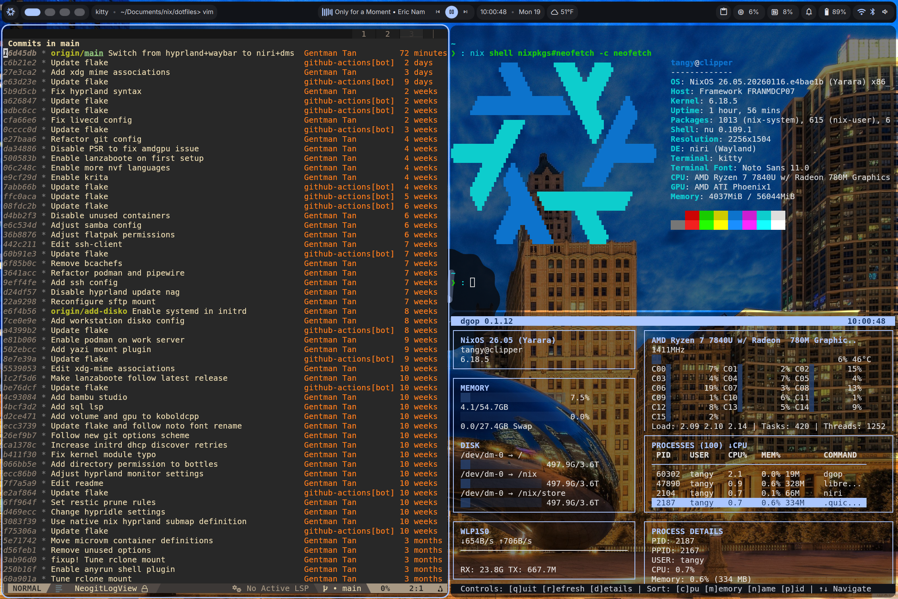

# ❄️ My NixOS Dotfiles ❄️
*'The cloud is just someone else's computer... except when it's your computer ☁️' edition*

## Screenshots

## Overview
This repository contains my NixOS configuration files. It includes separate flake references for several systems:
 - 💻 The [#workstation](./hosts/workstation/configuration-workstation.nix) configuration is interesting because it uses [flatpak sandboxing](./modules/nix-flatpak.nix) to isolate user applications, as well as [hyprland](https://github.com/hyprwm/Hyprland) for window managment and [nixvim](https://github.com/nix-community/nixvim) for text editing. 
 - ☁️ The [#server](./hosts/server/configuration-server.nix) configuration sets up a host that serves a bunch of containers using [podman](https://github.com/containers/podman) with support for remote unlocking and automatic OS/container upgrades.
 - 🎮 The [#gaming](./hosts/gaming/configuration-gaming.nix) configuration has both KDE and gamescope enabled as compositors, allowing you to choose either in KDM (the login screen). [With a few lines](https://search.nixos.org/options?channel=unstable&query=displayManager.autoLogin) you can also reconfigure it to auto-login to gamescope, making it truly deck-like.
 - 💿 The [#livecd](./hosts/server/configuration-server.nix) configuration is able to create a custom ISO with some of my favorite recovery tools, as well as an OpenSSH server. Build it by running `nix build .#nixosConfigurations.my-iso.config.system.build.isoImage`.

## Structure 
I go into more detail in an upcoming blog post as to how I came about planning and structuring these systems. Stay tuned!

## Installation
1. [Follow the steps to install NixOS normally.](https://nixos.org/download/)
   - It does not matter whether you use the graphical or minimal ISO image, your system will be completely rebuilt all the same!
2. Fork and clone this repo somewhere, for example `/etc/nixos`
3. Review the repo and modify to your heart's content, especially where lines are commented with `FIXME`.
   - 💡 Pro tip: You can search for these by running `grep --color=auto -rni "FIXME" <repo path>`
4. Replace the `hardware-configuration.nix` in `./hosts/<name of host>/` with that of which pertains to your own computer's.
   - 💡 Pro tip: The `hardware-configuration.nix` file should be located in `/etc/nixos`. If you don't see it, you can run `nixos-generate-config --dir <empty dir>` to generate it.
5. Run `nixos-rebuild switch --flake <path to your flake root>#<attribute>`, where `<attribute>` is either 'workstation', 'server' or 'gaming'.
   - If you have pushed changes to your own repo you can also build your system straight off of github using `nixos-rebuild switch github:<github username>/<reponame>#<attribute>`
6. Enjoy reproducable Linux!
   
## To-do
- [x] Refractor the repo to look more like a proper flake directory
- [x] Make a github action to automate upgrading the flake
- [x] Put package and service definitions in separate nix files
- [x] Configure server
  - [x] Add remote unlocking
  - [x] Add podman containers
  - [x] Setup [podman auto update](https://docs.podman.io/en/latest/markdown/podman-auto-update.1.html) daemon
  - [x] Setup wireguard networking for containers 
- [ ] Enable secure boot using lanzaboote
- [ ] Set up disko/nixos-anywhere for unattended deployment
