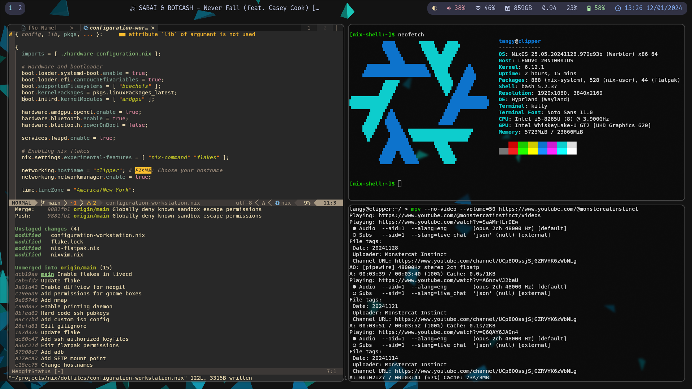

# My NixOS Dotfiles
*'It aint much but it's mine!' edition*

## Screenshots

## Overview
This repository contains my NixOS configuration files. It includes separate flake references for a [#workstation](configuration-workstation.nix) and a [#gaming](configuration-gaming.nix) system. The #workstation system in particular is of interest due to its use of [flatpak sandboxing](nix-flatpak.nix) to isolate user applications, as well as waybar and hyprland for window managment. The #gaming configuration has both KDE and gamescope enabled as compositors, allowing you to choose either in KDM (the login screen). [With a few lines](https://search.nixos.org/options?channel=unstable&query=displayManager.autoLogin) you can also reconfigure it to auto-login to gamescope, making it truly deck-like.

## Structure 
I go into more detail in an upcoming blog post as to how I came about planning and structuring the system. Stay tuned!

## Installation?
Every Linux system is different, and because of this merely cloning this repo and running `nixos-rebuild switch .#workstation` will, unfortunately, not work. Most notably, hardware-configuration.nix includes the UUID of your drive that will be different from mine. 
This configuration should basically only be used as a reference for your own dotfiles. To that end, I annotated places of interest with FIXME comments, which you can find by running `grep --color=auto -rni "FIXME" *` in this project's root. You can also search on https://search.nixos.org to find packages and options you would want to add to your derivation.

## To-do
- Refractor the repo to look more like a proper flake directory
- Allow for ease of installation through `github:` uri (may require impure build?)

Enjoy!
